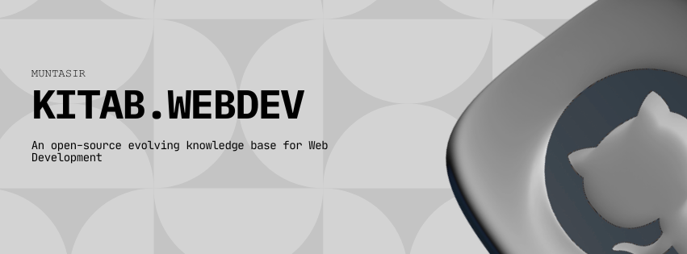

# Kitab.Webdev

Welcome to **Kitab.Webdev**, your companion in the world of web creation.

---

## 📖 What is Kitab.Webdev?

Kitab.Webdev is a **community-powered library** designed to make web development accessible to everyone.  
We gather the best ideas, guides, and wisdom from across the web into one simple, searchable place.

---

## 🌍 Our Vision

We believe that building for the web should be an **open door for everyone**.  
Whether you are just starting your journey or looking for advanced inspiration, Kitab.Webdev is here to help you grow and share your knowledge with fellow creators around the world.

---

🔗 Visit [Kitab.Webdev](https://webdev.muntasir.site)

